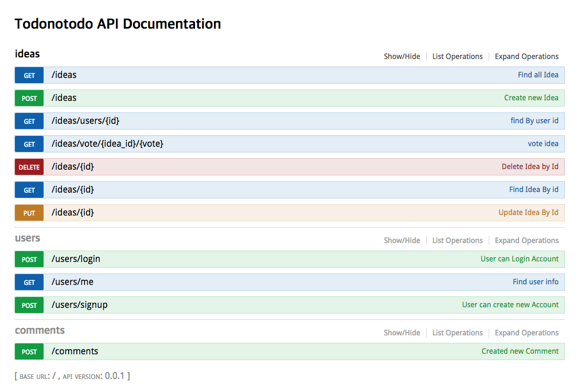

# todonotodo-api

> [Todotodo-web](https://github.com/Gavinkim/todonotodo-web)

### Description
`````sql
    - share idea and  discuss, vote
`````

### Pre settings and Start
```sql
    - install mongodb
    - install nodejs
    - install nodemon
    - npm install
    - npm start
```

### api doc

> > http://localhost:5959/documentation 

### Result

> > 